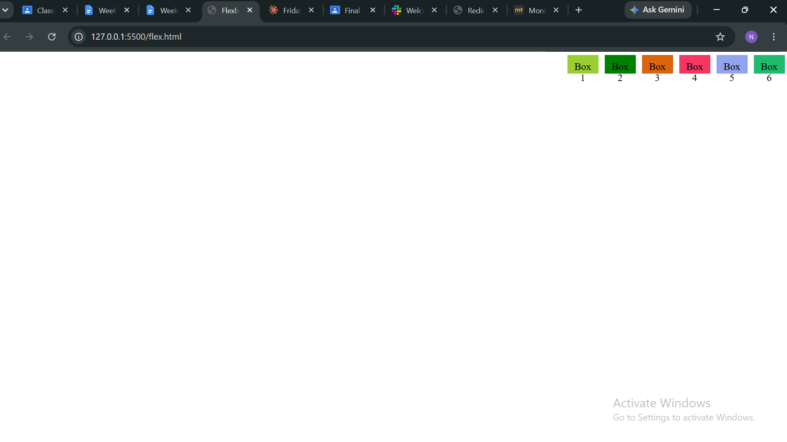
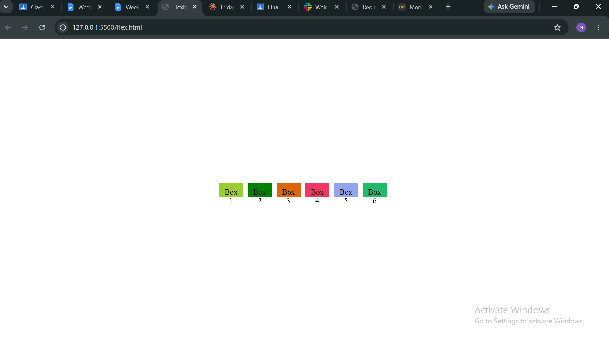
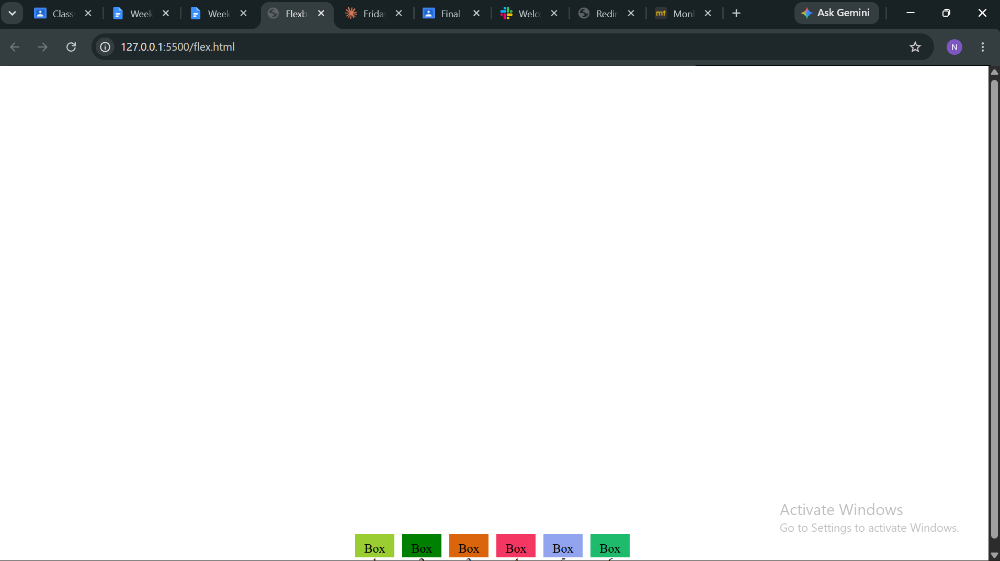

🎥 MOVING BOXES AROUND SCREEN
A full screen Flexbox layout with 6 colored, numbered boxes that animate through all 9 positions (Top Left → Bottom Right) using CSS @keyframes. Built with HTML and CSS only (no JavaScript).

Flexbox Properties Used:

display: flex  turns the container into a flex container
justify-content: aligns boxes left/center/right (main axis)
align-items:aligns boxes top/middle/bottom (cross axis)
flex-direction:sets layout direction (row or column)
flex-wrap:lets boxes wrap onto multiple lines (bonus layout)
gap:adds space between boxes
@keyframes & animation iteration count: infinite  animates the boxes through all 9 positions on a loop.

The 9 Positions
#	Position	  justify-content    	align-items
1	Top Left	   flex-start	        flex-start
2	Top Center	    center	            flex-start
3	Top Right	   flex-end	            flex-start
4	Middle Left	   flex-start	        center
5	Center	        center	             center
6	Middle Right	flex-end	         center
7	Bottom Left	    flex-start	        flex-end
8	Bottom Center	center	            flex-end
9	Bottom Right	flex-end	        flex-end

Screenshots
->Top right:

->Center:

->Bottom center:

Video Demostration :
Video link :https://drive.google.com/file/d/1cqWrgynrIGdH0Tc_31eGsruRBLkPzS5G/view?usp=sharing